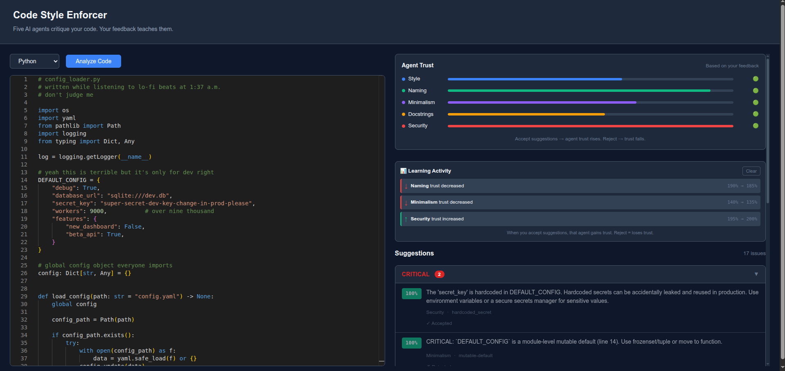
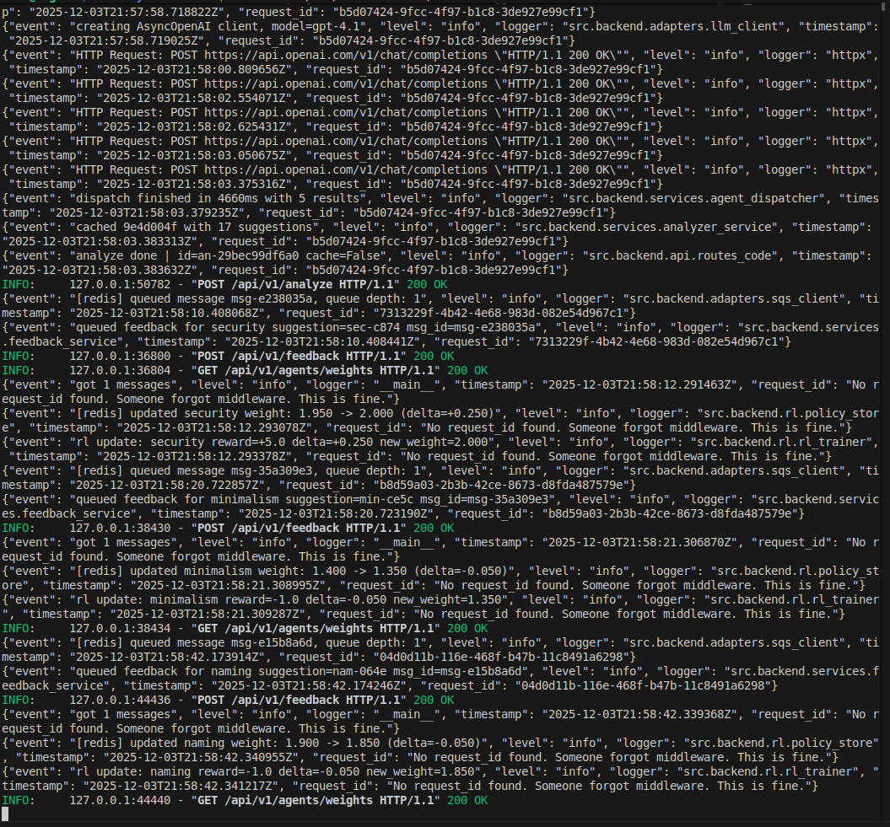

# Code Style Enforcer

Five AI agents roast your code. You vote on whether they're right. The system learns.

Built this to scratch an itch: most linters are static rule engines. I wanted something that adapts to what I actually care about vs what I keep dismissing.

**Author:** Bradley R. Kinnard



Left side is your code editor. Right side shows agent trust levels (the bars) and suggestions grouped by how bad they are. The "Learning Activity" panel at the bottom right is the interesting part, it shows weight changes happening live as you accept/reject stuff.

---

## Running It

You need Python 3.10+, Node 18+, Redis, and Poetry.

Easiest way:
```bash
./dev.sh
```

That starts everything. Backend on 8000, frontend on 3000, worker in background. Ctrl+C kills it all.

If you want separate terminals (useful for watching logs):
```bash
# term 1
poetry run poe local

# term 2
poetry run poe local-worker

# term 3
cd frontend && npm i && npm run dev
```

Docker works too (`docker-compose up`) but honestly overkill for dev.

---

## The Agents

Five of them run in parallel:

- **minimalism** catches duplicate calls, dead code, unnecessary complexity. Can flag severity 5 (critical) for stuff like calling an expensive function twice.
- **security** looks for injections, hardcoded secrets, async footguns, regex DoS. Also goes up to severity 5.
- **naming** complains about unclear variable names. Caps at 4.
- **style** is your typical formatting nag. Severity 1-3.
- **docstring** wants you to document things. Also 1-3.

Severity 5 = production bugs. Severity 1 = eh, maybe fix it someday.

---

## The RL Part

This is the actual point of the project.

When you click Accept or Reject on a suggestion, that feedback goes into a queue. A background worker picks it up and adjusts that agent's weight. Accept something good? Agent gets +0.250 trust. Reject something dumb? Only -0.050. Asymmetric on purpose, don't want to punish agents too hard for occasional misses.



Those `[redis] updated X weight` lines are the proof. Each one is a real write to Redis. The weights persist, so if you restart the server tomorrow your agents still remember what you liked.

```
[redis] updated security weight: 1.950 → 2.000 (delta=+0.250)
[redis] updated minimalism weight: 1.400 → 1.350 (delta=-0.050)
```

Weights stay between 0.1 and 2.0. An agent you keep rejecting will eventually have its suggestions sorted to the bottom. One you always accept floats to the top.

---

## Architecture



Code comes in, gets sent to all 5 agents at once (async). Results merge together, weighted by how much we trust each agent. Frontend shows suggestions. You click. Feedback queues up. Worker processes it. Weights update in Redis (or DynamoDB in prod). Next analysis uses the new weights. Loop.

The queue thing matters because I didn't want feedback clicks to block on RL computation. Click returns in <10ms, actual weight update happens async.

---

## API

```
POST /api/v1/analyze        send code, get suggestions
POST /api/v1/feedback       accept/reject (async, queued)
GET  /api/v1/agents/weights current trust levels
GET  /api/v1/health         is it alive
```

Example:
```bash
curl -X POST http://localhost:8000/api/v1/analyze \
  -H "Content-Type: application/json" \
  -d '{"language": "python", "code": "def foo():\n  x = 1\n  x = 2\n  return x"}'
```

---

## Env Setup

Copy `.env.example` to `.env`, add your OpenAI key:

```
OPENAI_API_KEY=sk-...
REDIS_URL=redis://localhost:6379
```

Local mode (what `poe local` uses) stores everything in Redis. Production mode uses SQS + DynamoDB.

---

## Common Issues

**Weights not changing?** Worker probably isn't running. Check `poe local-worker` is up. Look for "updated weight" in logs.

**Frontend 404s?** Backend needs to be on port 8000. Vite proxies `/api` there.

**Redis won't connect?** `redis-server` or `brew services start redis`.

---

## Tests

```bash
poetry run pytest
poetry run pytest tests/unit -v
poetry run pytest -k "test_reward"
```

---

## File Layout

```
src/backend/
  agents/       the 5 agents + base class
  api/          fastapi routes
  rl/           reward engine, trainer, policy store
  services/     analyzer, merger, feedback handling
  workers/      feedback processor (long-running)
frontend/       react + vite
tests/          unit, integration, e2e
infra/          terraform stuff
```

---

MIT
